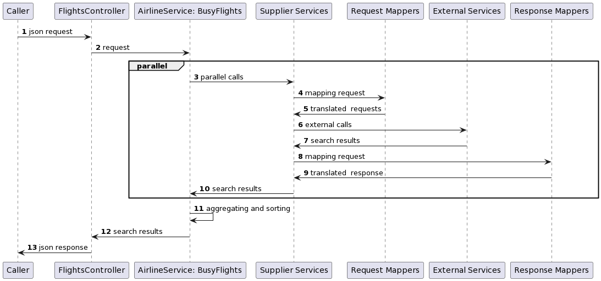
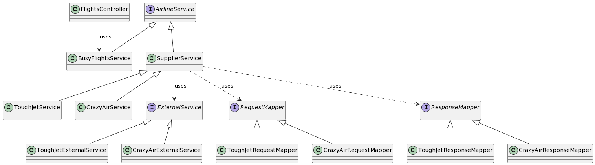

# Travix Flights

## Requirements

### System Requirement

JDK 11 or later

### Parallelism

The two external endpoints are called in parallel. If more suppliers are added, they will be called in parallel too.

    if a call to a supplier fails
        then results from other suppliers will be included in the BusyFlightResponse
        and the result from the failed supplier will be omitted 
        (no exception is throw, no error object is returned to the user)
        and the call will not be tried in the scope of the current request

### Sorting

The results are sorted by fare _from the lowest fare to the highest_

### Input Validation

#### BusyFlightRequest

    destination:
        if destination is shorter then 3 characters (or null)
        then exception is thrown

        if destination is longer than 3 characters
        then exception is thrown

        if the destination is null
        then exception is thrown

    origin:
        if origin is shorter then 3 characters (or null)
        then exception is thrown

        if origin is longer than 3 characters
        then exception is thrown

    departureDate:
        if it is not in ISO_LOCAL_DATE format
        then exception is thrown

    returnDate:
        if it is not in ISO_LOCAL_DATE format
        then exception is thrown

    numberOfPassangers:
        if it is greater than 4
        then exception is thrown

        if it is less than 1
        then expeption is thrown

### Type Conversion

#### BusyFlightsRequest --> CrazyAirRequest

| Input              | Output         | Remarks           |
|--------------------|----------------|-------------------|
| origin             | origin         |                   |
| destination        | destination    |                   |
| departureDate      | departureDate  | same date formats |
| returnDate         | returnDate     | same date formats |
| numberOfPassengers | passengerCount |                   |

#### BusyFlightsRequest --> ToughJetRequest

| Input              | Output         | Remarks                                         |
|--------------------|----------------|-------------------------------------------------|
| origin             | from           |                                                 |
| destination        | to             |                                                 |
| departureDate      | outboundDate   | same date formats                               |
| returnDate         | inboundDate    | same date formats                               |
| numberOfPassengers | numberOfAdults | assuming that children can be counted as adults |

#### CrazyAirResponse --> BusyFlightsResponse

| Input                  | Output                 | Remarks                                                            |
|------------------------|------------------------|--------------------------------------------------------------------|
| airline                | airline                |                                                                    |
| _none_                 | supplier               | fixed text: 'CrazyAir'                                             |
| price                  | fare                   | assuming that no currency conversion is needed                     |
| cabinclass             | _none_                 | not in use                                                         |
| departureAirportCode   | departureAirportCode   |                                                                    |
| destinationAirportCode | destinationAirportCode |                                                                    |
| departureDate          | departureDate          | format must be converted from ISO_LOCAL_DATE_TIME to ISO_DATE_TIME |
| arrivalDate            | arrivalDate            | format must be converted from ISO_LOCAL_DATE_TIME to ISO_DATE_TIME |

#### ToughJetResponse --> BusyFlightsResponse

| Input                | Output                 | Remarks                                                                                                                                                                                                                                        |
|----------------------|------------------------|------------------------------------------------------------------------------------------------------------------------------------------------------------------------------------------------------------------------------------------------|
| carrier              | airline                |                                                                                                                                                                                                                                                |
| _none_               | supplier               | fixed text: 'ToughJet'                                                                                                                                                                                                                         |
| basePrice            | fare                   | fare = round((basePrice - discount) * (1 + tax), 2) -- assumes that the fare is not negative and not greater than Double.MAX_VALUE / 100 and 2 decimal places means that not more than 2 decimal places (for example 1.1 is preferred to 1.10) |
| tax                  | fare                   | included in the fare, assumes that the tax is a percentage of the price, e.g. 5%                                                                                                                                                               |
| discount             | fare                   | included in the fare, assumes that the discount is a fix amount, e.g. £20                                                                                                                                                                      |
| departureAirportName | departureAirportCode   |                                                                                                                                                                                                                                                |
| arrivalAirportName   | destinationAirportCode |                                                                                                                                                                                                                                                |
| outboundDateTime     | departureDate          | format must be converted from ISO_INSTANT to ISO_DATE_TIME - assuming the time zone is UTC                                                                                                                                                     |
| inboundDateTime      | arrivalDate            | format must be converted from ISO_INSTANT to ISO_DATE_TIME - assuming the time zone is UTC                                                                                                                                                     |

## How to add a new supplier

1. Create request and response model
2. Create a request mapper that implements the RequestMapper interface
3. Create a response mapper that implements the ResponseMapper interface
4. Create a supplier service by extending the SupplierService class
5. Use the new supplier service class in BusyFlightsService:
```java
    @Override
    public List<BusyFlightsResponse> search(BusyFlightsRequest request) {
        return Stream.of(
                        CompletableFutureFlights.supplyAsyncThenHandle(() -> crazyAirService.search(request)),
                        CompletableFutureFlights.supplyAsyncThenHandle(() -> toughJetService.search(request))
                        // Add new service here
                ).map(CompletableFuture::join)
                .reduce(new ArrayList<>(), (a, b) -> {
                    a.addAll(b);
                    return a;
                })
                .stream()
                .sorted(Comparator.comparing(BusyFlightsResponse::getFare))
                .collect(Collectors.toList());
    }
```

## Sequence Diagram



## Class Diagram


